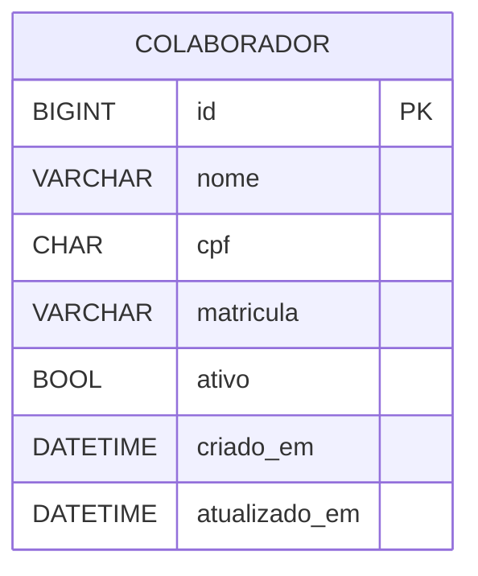
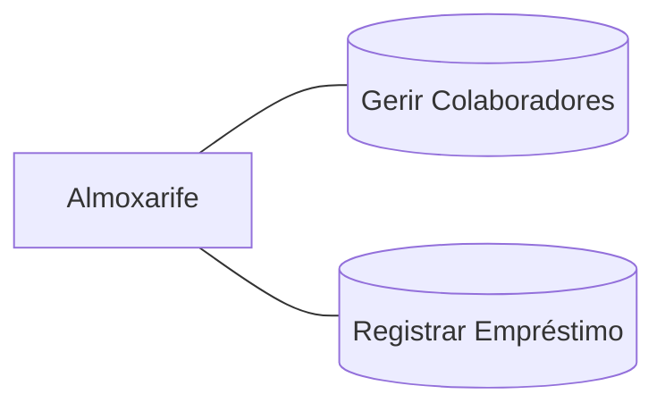
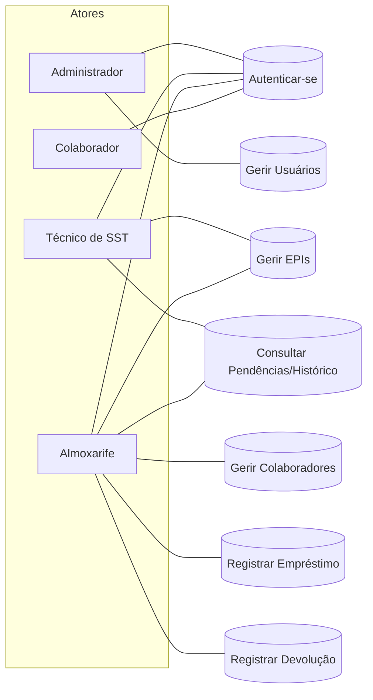

# EPI MVP — Etapa 2 (Django)

CRUD de **Colaboradores** com persistência em **MySQL**, desenvolvido em **Python/Django**.

## 📦 Tecnologias
- Django 4.2 (LTS)
- MySQL 8.0
- mysqlclient
- Bootstrap 5 (CDN)

  ---

## 🚀 Como executar (VS Code)

## 1) Clone / crie o projeto
 ```
 git clone https://github.com/<sua-conta>/epi-mvp.git
cd epi_mvp
```
---
## 2) Ambiente virtual
```
python -m venv .venv
 Windows: .venv\Scripts\activate
 Linux/Mac:
source .venv/bin/activate
```
---
## 3) Dependências
```
pip install -r requirements.txt
```
---

## 4) Configurar variáveis (copie e edite .env)
```
cp .env.example .env
```
---
## 5) Migrações
```
python manage.py makemigrations colaboradores
python manage.py migrate
```
---
## 6) Rodar
```python manage.py runserver
# Abra http://127.0.0.1:8000/ (redireciona para /colaboradores/)
```
---

> Obs.: o banco configurado no `.env` (DB_NAME=epi_simplificado) deve existir em seu MySQL.

## 👤 Acesso ao admin (opcional)
```bash
python manage.py createsuperuser
# depois acesse: http://127.0.0.1:8000/admin/
```

## 🧭 Rotas principais
- `GET /colaboradores/` — lista com paginação e busca
- `GET /colaboradores/novo/` — formulário de criação
- `GET /colaboradores/<id>/editar/` — edição
- `GET /colaboradores/<id>/excluir/` — confirmação de exclusão

## 🗃️ Diagrama ER (Mermaid)


## 🧩 Caso de Uso (Mermaid)

---

## ✅ Requisitos cobertos
- CRUD completo de Colaboradores.
- Persistência MySQL via ORM.
- Validações de unicidade (CPF, matrícula).
- Busca e paginação.

---

## 🧪 Teste rápido
1. Suba o MySQL (local ou via docker-compose).
2. `python manage.py migrate`
3. Acesse `/colaboradores/`, crie/edite/exclua, e verifique no banco.

---

# 📌 Sistema de Controle de EPIs

## 1) Escopo resumido
**Objetivo:** controlar cadastro de EPIs, colaboradores e o empréstimo/devolução de itens.  

**Perfis de usuário:**  
- ADMIN  
- TECNICO_SST  
- ALMOXARIFE  
- COLABORADOR  

(campo `perfil` em **usuario**)  

---

## 2) DER 


--- 
## 3) Diagrama de Casos de Uso



---

## 4) Requisitos Funcionais

RF01 — Autenticação e perfil: login por e-mail/senha; acesso conforme perfil.

RF02 — Cadastro de colaboradores: CRUD básico; validações de CPF e matrícula únicos.

RF03 — Cadastro de EPIs: CRUD básico; controle simples de estoque (inteiro), ca_numero e ca_validade (opcional).

RF04 — Empréstimo: criar cabeçalho (emprestimo) e itens (emprestimo_item) com quantidade; reduzir epi.estoque.

RF05 — Devolução: registrar devolvido_em por item; somar de volta no epi.estoque.

RF06 — Consulta: listar pendências de devolução por colaborador e histórico por período.

RF07 — Alertas simples (opcional): destacar itens com previsão vencida ou CA expirado.

---

## 5) Requisitos Não Funcionais

RNF01 — Usabilidade: até 3 cliques para registrar empréstimo; layout responsivo.

RNF02 — Segurança: senha com hash; perfis aplicados no backend; sessões expiram por inatividade.

RNF03 — Desempenho: listagens comuns em até 2s em rede local.

RNF04 — Disponibilidade: uso em horário comercial; backup diário do banco.

RNF05 — Manutenibilidade: arquitetura em camadas (API, serviço, persistência) + logs mínimos de erro.

RNF06 — Portabilidade: MySQL 8.0+, compatível com Workbench.

---
## 6) Wireframes (mínimos)

```text
Login
+-------------------------+
|  LOGO                   |
|  Email: [___________]   |
|  Senha: [___________]   |
|  [ Entrar ]             |
+-------------------------+

Dashboard
+----------------------------------------------------+
| Pendentes de Devolução: [12]  | Empréstimos hoje: 5|
| CA(s) de EPI vencidos: 2 (alerta)                  |
| Busca rápida: [ Colaborador / EPI ]                |
+----------------------------------------------------+

EPIs (CRUD + estoque simples)
[ + Novo EPI ]  [Buscar: __________ ]
| Código | Nome | Tamanho | CA | Validade | Estoque | Ações |

Colaboradores
[ + Novo Colaborador ] [Buscar: _______ ]
| Matrícula | Nome | CPF | Ativo | Ações |

Empréstimos
[ + Novo Empréstimo ] [Buscar por colaborador: ______ ]
| Nº | Colaborador | Itens Pendentes | Prev. Devolução | Status | Ações |

Novo Empréstimo
Colaborador: [selecionar]
Itens:
  [ + Adicionar EPI ]
   -> EPI [select]  Quantidade [__]  [Remover]
Previsão devolução: [data/hora]
[ Confirmar ]  [ Cancelar ]

Devolução
Filtro: [Colaborador] [Somente pendentes]
| Empréstimo | EPI | Qtde | Entregue em | Devolver [__] | Ação |
[ Confirmar devolução ]

```

--- 

## 7) Regras de Negócio

RB01: quantidade > 0 em emprestimo_item.

RB02: Não permitir saída se epi.estoque < quantidade.

RB03: Devolução soma quantidade ao epi.estoque e preenche devolvido_em.

RB04: Se ca_validade existir e estiver vencida, exibir aviso (não bloqueia no mínimo).

RB05: status do empréstimo vai para FECHADO quando todos os itens forem devolvidos.

---

## 8) Critérios de Aceite (MVP)

✅ Cadastrar usuários, colaboradores e EPIs.
✅ Criar empréstimo com 1..N itens e reduzir estoque.
✅ Registrar devolução total/parcial e recompor estoque.
✅ Listar pendências por colaborador e fechar empréstimo quando não houver mais pendências.
✅ Exportar listagens em CSV (opcional).
